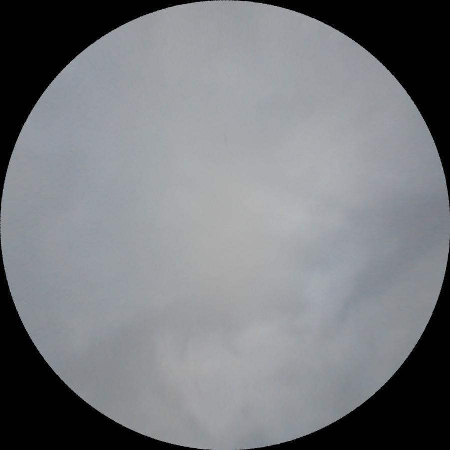

# 飞机尾迹云层图像分割系统源码＆数据集分享
 [yolov8-seg-LSKNet＆yolov8-seg-RepHGNetV2等50+全套改进创新点发刊_一键训练教程_Web前端展示]

### 1.研究背景与意义

项目参考[ILSVRC ImageNet Large Scale Visual Recognition Challenge](https://gitee.com/YOLOv8_YOLOv11_Segmentation_Studio/projects)

项目来源[AAAI Global Al lnnovation Contest](https://kdocs.cn/l/cszuIiCKVNis)

研究背景与意义

随着航空运输业的迅猛发展，飞机在高空飞行过程中所产生的尾迹云（contrails）逐渐成为气候变化研究和环境监测的重要对象。尾迹云是飞机排放的水蒸气在高空低温环境中凝结形成的云层，具有显著的气候效应。研究表明，尾迹云不仅影响地球的辐射强度，还可能对局部气候和生态系统造成潜在影响。因此，准确识别和分割尾迹云图像，对于理解其对气候变化的影响、评估航空活动的环境代价以及制定相应的政策具有重要意义。

在这一背景下，图像分割技术的应用显得尤为重要。传统的图像处理方法在处理复杂的尾迹云图像时，往往面临着分割精度低、处理速度慢等问题。近年来，深度学习技术的快速发展为图像分割提供了新的解决方案。其中，YOLO（You Only Look Once）系列模型因其高效的实时检测能力和较高的准确性而受到广泛关注。YOLOv8作为该系列的最新版本，进一步提升了模型的性能，尤其在处理复杂场景和多类别目标时表现出色。

本研究旨在基于改进的YOLOv8模型，构建一个针对飞机尾迹云层的图像分割系统。该系统将利用2200张经过标注的尾迹云图像数据集，涵盖六个类别，包括不同阶段的尾迹云（如“contrail old”、“contrail veryold”、“contrail young”）以及与之相关的其他元素（如“parasite”、“sun”、“unknown”）。通过对这些类别的深入分析和模型训练，期望能够实现对尾迹云的精准分割和分类，从而为后续的气候研究提供更为可靠的数据支持。

此外，改进YOLOv8模型的应用不仅能够提升尾迹云的检测和分割精度，还能在处理速度上实现显著优化。这对于实时监测航空活动及其环境影响具有重要意义。通过构建高效的图像分割系统，研究者能够更快速地获取尾迹云的空间分布信息，进而为气候模型的构建和验证提供必要的数据基础。

综上所述，本研究的开展不仅具有重要的理论意义，还具有广泛的应用前景。通过对尾迹云的深入分析和精准分割，能够为气候变化研究提供新的视角，促进航空与环境科学的交叉研究。同时，该系统的成功构建也将为其他领域的图像分割研究提供借鉴，推动相关技术的进一步发展。

### 2.图片演示


##### 注意：由于此博客编辑较早，上面“2.图片演示”和“3.视频演示”展示的系统图片或者视频可能为老版本，新版本在老版本的基础上升级如下：（实际效果以升级的新版本为准）

  （1）适配了YOLOV8的“目标检测”模型和“实例分割”模型，通过加载相应的权重（.pt）文件即可自适应加载模型。

  （2）支持“图片识别”、“视频识别”、“摄像头实时识别”三种识别模式。

  （3）支持“图片识别”、“视频识别”、“摄像头实时识别”三种识别结果保存导出，解决手动导出（容易卡顿出现爆内存）存在的问题，识别完自动保存结果并导出到tempDir中。

  （4）支持Web前端系统中的标题、背景图等自定义修改，后面提供修改教程。

  另外本项目提供训练的数据集和训练教程,暂不提供权重文件（best.pt）,需要您按照教程进行训练后实现图片演示和Web前端界面演示的效果。

### 3.视频演示

[3.1 视频演示](https://www.bilibili.com/video/BV17xyHYrERg/)

### 4.数据集信息展示

##### 4.1 本项目数据集详细数据（类别数＆类别名）

nc: 6
names: ['contrail old', 'contrail veryold', 'contrail young', 'parasite', 'sun', 'unknow']


##### 4.2 本项目数据集信息介绍

数据集信息展示

在现代航空技术和气候研究中，飞机尾迹云层的检测与分析成为了一个重要的研究领域。为了推动这一领域的进展，我们构建了一个专门用于训练改进YOLOv8-seg的飞机尾迹云层图像分割系统的数据集，命名为“contrails detection”。该数据集的设计旨在提供丰富的图像样本，以便有效地训练深度学习模型，提升其在尾迹云层图像分割任务中的表现。

“contrails detection”数据集包含六个主要类别，分别为“contrail old”、“contrail veryold”、“contrail young”、“parasite”、“sun”和“unknow”。这些类别的划分不仅反映了尾迹云层的不同生长阶段，还涵盖了与尾迹云层相关的其他重要元素。具体而言，“contrail young”类别代表新形成的尾迹云层，通常具有较为清晰的边界和较高的对比度；而“contrail old”则指那些已经存在一段时间的尾迹云层，其形态可能会因环境因素而发生变化，边界模糊，颜色渐变。“contrail veryold”则是指那些已经几乎消散的尾迹云层，可能仅留下微弱的痕迹。

在此基础上，数据集中还包含“parasite”类别，这一类别主要用于标识与尾迹云层相似但并非由飞机产生的云层现象，能够帮助模型更好地区分真正的尾迹云层与其他云层类型。此外，“sun”类别则用于标记图像中出现的太阳光斑或反射，这在图像分割过程中可能会对模型的判断产生影响，因此进行单独标记以提高模型的准确性。最后，“unknow”类别则用于处理那些无法明确分类的图像，确保数据集的完整性和多样性。

数据集的构建过程遵循严格的标准，确保图像的质量和标注的准确性。我们从多个来源收集了大量的航空图像，涵盖了不同的天气条件、时间段和地理位置，以确保数据集的多样性和代表性。每一张图像都经过精细的标注，确保每个类别的特征能够被清晰地识别和学习。通过这种方式，我们希望能够训练出一个高效的图像分割模型，使其能够在实际应用中准确识别和分割飞机尾迹云层。

此外，为了进一步增强模型的泛化能力，我们还进行了数据增强处理，包括旋转、缩放、翻转等操作。这些操作不仅增加了数据集的样本数量，还帮助模型在面对不同场景和条件时，依然能够保持较高的识别精度。我们相信，通过对“contrails detection”数据集的充分利用，改进YOLOv8-seg的飞机尾迹云层图像分割系统将能够在航空气象研究、环境监测等领域发挥重要作用，为相关研究提供强有力的技术支持。

总之，“contrails detection”数据集的构建与应用，标志着我们在飞机尾迹云层检测与分析领域迈出了重要的一步。通过这一数据集，我们期望能够推动相关技术的发展，为未来的航空安全和气候变化研究提供更加精确的工具和方法。





### 5.全套项目环境部署视频教程（零基础手把手教学）

[5.1 环境部署教程链接（零基础手把手教学）](https://www.bilibili.com/video/BV1jG4Ve4E9t/?vd_source=bc9aec86d164b67a7004b996143742dc)


[5.2 安装Python虚拟环境创建和依赖库安装视频教程链接（零基础手把手教学）](https://www.bilibili.com/video/BV1nA4VeYEze/?vd_source=bc9aec86d164b67a7004b996143742dc)

### 6.手把手YOLOV8-seg训练视频教程（零基础小白有手就能学会）

[6.1 手把手YOLOV8-seg训练视频教程（零基础小白有手就能学会）](https://www.bilibili.com/video/BV1cA4VeYETe/?vd_source=bc9aec86d164b67a7004b996143742dc)


按照上面的训练视频教程链接加载项目提供的数据集，运行train.py即可开始训练



     Epoch   gpu_mem       box       obj       cls    labels  img_size
     1/200     0G   0.01576   0.01955  0.007536        22      1280: 100%|██████████| 849/849 [14:42<00:00,  1.04s/it]
               Class     Images     Labels          P          R     mAP@.5 mAP@.5:.95: 100%|██████████| 213/213 [01:14<00:00,  2.87it/s]
                 all       3395      17314      0.994      0.957      0.0957      0.0843

     Epoch   gpu_mem       box       obj       cls    labels  img_size
     2/200     0G   0.01578   0.01923  0.007006        22      1280: 100%|██████████| 849/849 [14:44<00:00,  1.04s/it]
               Class     Images     Labels          P          R     mAP@.5 mAP@.5:.95: 100%|██████████| 213/213 [01:12<00:00,  2.95it/s]
                 all       3395      17314      0.996      0.956      0.0957      0.0845

     Epoch   gpu_mem       box       obj       cls    labels  img_size
     3/200     0G   0.01561    0.0191  0.006895        27      1280: 100%|██████████| 849/849 [10:56<00:00,  1.29it/s]
               Class     Images     Labels          P          R     mAP@.5 mAP@.5:.95: 100%|███████   | 187/213 [00:52<00:00,  4.04it/s]
                 all       3395      17314      0.996      0.957      0.0957      0.0845


### 7.50+种全套YOLOV8-seg创新点代码加载调参视频教程（一键加载写好的改进模型的配置文件）

[7.1 50+种全套YOLOV8-seg创新点代码加载调参视频教程（一键加载写好的改进模型的配置文件）](https://www.bilibili.com/video/BV1Hw4VePEXv/?vd_source=bc9aec86d164b67a7004b996143742dc)

### 8.YOLOV8-seg图像分割算法原理

原始YOLOV8-seg算法原理

YOLOv8-seg算法是YOLO系列中的一个重要分支，旨在通过对图像进行目标检测和分割，实现更为精确的物体识别与定位。相较于传统的基于锚框的检测方法，YOLOv8-seg采用了无锚框（anchor-free）策略，这一创新使得算法在检测精度和速度上都有了显著提升。YOLOv8-seg的设计理念不仅关注于目标的边界框定位，还进一步扩展到对目标的像素级分割，这对于复杂环境下的小目标检测尤为重要。

YOLOv8-seg的网络结构主要由四个核心模块组成：输入端、主干网络、Neck端和输出端。输入端负责对输入图像进行预处理，包括马赛克数据增强、自适应图像缩放和灰度填充等。这些预处理步骤旨在提高模型的鲁棒性，使其能够更好地适应不同的输入条件。主干网络则是特征提取的核心部分，采用了CSPDarknet结构，通过卷积和池化操作提取图像的深层特征。与前代模型相比，YOLOv8-seg在主干网络中引入了C2f模块，这一模块通过分支结构和跨层连接的方式，增强了特征的梯度流，提升了特征表示能力。

在Neck端，YOLOv8-seg采用了路径聚合网络（PAN）结构，通过上下采样和特征拼接，融合不同尺度的特征图。这一设计使得模型能够有效地捕捉到多尺度目标的信息，尤其是在复杂背景下的小目标检测中，能够显著提升检测的准确性和鲁棒性。输出端则通过解耦头结构，将分类和回归过程分开处理，这一策略不仅提高了模型的灵活性，还简化了损失计算过程。YOLOv8-seg在损失计算中使用了二元交叉熵损失（BCE）和分布焦点损失（DFL），以此来优化分类和回归的性能。

尽管YOLOv8-seg在多个方面都进行了创新和改进，但在复杂水面环境下的应用仍然面临挑战。小目标漂浮物的特征复杂且背景多样，导致YOLOv8-seg在定位和目标感知能力上存在一定的不足。为了解决这些问题，研究者们提出了YOLOv8-WSSOD算法，旨在通过引入BiFormer双层路由注意力机制和其他技术手段，进一步提升YOLOv8-seg的性能。

在YOLOv8-WSSOD中，首先引入了捕获远程依赖的思想，以减轻主干网络下采样过程中的噪声影响。BiFormer模块通过双层路由注意力机制，能够更好地保留特征提取过程中细粒度的上下文信息，从而提高对小目标的感知能力。此外，为了应对小目标漏检的问题，YOLOv8-WSSOD在网络中添加了一个更小的检测头，这一改进使得模型在处理小目标时更加敏感。

在Neck端，YOLOv8-WSSOD引入了GSConv和Slim-neck技术，这些技术不仅能够保持模型的精度，还能有效降低计算量，从而提升整体的检测速度和效率。最后，YOLOv8-WSSOD使用了MPDIoU损失函数替代CIoU损失函数，以提高模型的泛化能力和精准度。这一系列的改进使得YOLOv8-WSSOD在复杂环境下的表现得到了显著提升，尤其是在小目标检测和分割任务中。

综上所述，YOLOv8-seg算法通过无锚框的设计和高效的特征提取机制，成功实现了目标检测与分割的融合。尽管在复杂环境下仍面临挑战，但通过进一步的改进和优化，YOLOv8-seg及其衍生算法如YOLOv8-WSSOD，展现出了强大的应用潜力。未来，随着算法的不断演进和优化，YOLOv8-seg有望在更多实际应用场景中发挥重要作用，推动计算机视觉领域的发展。


### 9.系统功能展示（检测对象为举例，实际内容以本项目数据集为准）

图9.1.系统支持检测结果表格显示

  图9.2.系统支持置信度和IOU阈值手动调节

  图9.3.系统支持自定义加载权重文件best.pt(需要你通过步骤5中训练获得)

  图9.4.系统支持摄像头实时识别

  图9.5.系统支持图片识别

  图9.6.系统支持视频识别

  图9.7.系统支持识别结果文件自动保存

  图9.8.系统支持Excel导出检测结果数据


### 10.50+种全套YOLOV8-seg创新点原理讲解（非科班也可以轻松写刊发刊，V11版本正在科研待更新）

#### 10.1 由于篇幅限制，每个创新点的具体原理讲解就不一一展开，具体见下列网址中的创新点对应子项目的技术原理博客网址【Blog】：


[10.1 50+种全套YOLOV8-seg创新点原理讲解链接](https://gitee.com/qunmasj/good)

#### 10.2 部分改进模块原理讲解(完整的改进原理见上图和技术博客链接)【如果此小节的图加载失败可以通过CSDN或者Github搜索该博客的标题访问原始博客，原始博客图片显示正常】
### 可变性卷积DCN简介
卷积神经网络由于其构建模块中固定的几何结构，本质上受限于模型几何变换。为了提高卷积神经网络的转换建模能力，《Deformable Convolutional Networks》作者提出了两个模块：可变形卷积（deformable convolution）和可变形RoI池（deformable RoI pooling）。这两个模块均基于用额外的偏移来增加模块中的空间采样位置以及从目标任务中学习偏移的思想，而不需要额外的监督。

第一次证明了在深度神经网络中学习密集空间变换（dense spatial transformation）对于复杂的视觉任务是有效的

视觉识别中的一个关键挑战是如何适应对象比例、姿态、视点和零件变形中的几何变化或模型几何变换。一般有两种方法实现：
1）建立具有足够期望变化的训练数据集。这通常通过增加现有的数据样本来实现，例如通过仿射变换。但是训练成本昂贵而且模型参数庞大。
2）使用变换不变（transformation-invariant）的特征和算法。比如比较有名的SIFT(尺度不变特征变换)便是这一类的代表算法。

但以上的方法有两个缺点：
1）几何变换被假定为固定的和已知的，这些先验知识被用来扩充数据，设计特征和算法。为此，这个假设阻止了对具有未知几何变换的新任务的推广，从而导致这些几何变换可能没有被正确建模。
2）对于不变特征和算法进行手动设计，对于过于复杂的变换可能是困难的或不可行的。

卷积神经网络本质上局限于模拟大型未知转换。局限性源于CNN模块的固定几何结构：卷积单元在固定位置对输入特征图进行采样；池化层以固定比率降低特征矩阵分辨率；RoI（感兴趣区域）池化层将RoI分成固定的空间箱（spatial bins）等。缺乏处理几何变换的内部机制。

这种内部机制的缺乏会导致一些问题，举个例子。同一个CNN层中所有激活单元的感受野大小是相同的，但是这是不可取的。因为不同的位置可能对应于具有不同尺度或变形的对象，所以尺度或感受野大小的自适应确定对于具有精细定位的视觉识别是渴望的。

对于这些问题，作者提出了两个模块提高CNNs对几何变换建模的能力。


deformable convolution（可变形卷积）
将2D偏移量添加到标准卷积中的常规网格采样位置，使得采样网格能够自由变形。通过额外的卷积层，从前面的特征映射中学习偏移。因此，变形采用局部、密集和自适应的方式取决于输入特征。


deformable RoI pooling（可变形RoI池化）
为先前RoI池化的常规库（bin）分区中的每个库位置（bin partition）增加了一个偏移量。类似地，偏移是从前面的特征图和感兴趣区域中学习的，从而能够对具有不同形状的对象进行自适应部件定位（adaptive part localization）。

#### Deformable Convolutional Networks
Deformable Convolution
2D卷积由两个步骤组成：
1）在输入特征图x xx上使用规则网格R RR进行采样。
2）把这些采样点乘不同权重w ww后相加。

网格R定义感受野大小和扩张程度，比如内核大小为3x3，扩张程度为1的网格R可以表示为：
R = { ( − 1 , − 1 ) , ( − 1 , 0 ) , … , ( 0 , 1 ) , ( 1 , 1 ) } R = \{(-1,-1),(-1,0),\dots,(0,1),(1,1)\}
R={(−1,−1),(−1,0),…,(0,1),(1,1)}

​
 一般为小数，使用双线性插值进行处理。（把小数坐标分解到相邻的四个整数坐标点来计算结果）


具体操作如图所示：


首先对输入特征层进行一个普通的3x3卷积处理得到偏移域（offset field）。偏移域特征图具有与输入特征图相同的空间分辨率，channels维度2N对应于N个2D（xy两个方向）偏移。其中的N是原输入特征图上所具有的N个channels，也就是输入输出channels保持不变，这里xy两个channels分别对输出特征图上的一个channels进行偏移。确定采样点后就通过与相对应的权重w点乘相加得到输出特征图上该点最终值。

前面也提到过，由于这里xy两个方向所训练出来的偏移量一般来说是一个小数，那么为了得到这个点所对应的数值，会采用双线性插值的方法，从最近的四个邻近坐标点中计算得到该偏移点的数值，公式如下：


具体推理过程见：双线性插值原理

#### Deformable RoI Poolingb
所有基于区域提议（RPN）的对象检测方法都使用RoI池话处理，将任意大小的输入矩形区域转换为固定大小的特征图。


 一般为小数，需要使用双线性插值进行处理。


具体操作如图所示：


当时看这个部分的时候觉得有些突兀，明明RoI池化会将特征层转化为固定尺寸的区域。其实，我个人觉得，这个部分与上述的可变性卷积操作是类似的。这里同样是使用了一个普通的RoI池化操作，进行一些列处理后得到了一个偏移域特征图，然后重新作用于原来的w × H w \times Hw×H的RoI。只不过这里不再是规律的逐行逐列对每个格子进行池化，而是对于格子进行偏移后再池化处理。

#### Postion﹣Sensitive RoI Pooling
除此之外，论文还提出一种PS RoI池化（Postion﹣Sensitive RoI Pooling）。不同于上述可变形RoI池化中的全连接过程，这里使用全卷积替换。

具体操作如图所示：


首先，对于原来的特征图来说，原本是将输入特征图上的RoI区域分成k × k k\times kk×k个bin。而在这里，则是将输入特征图进行卷积操作，分别得到一个channels为k 2 ( C + 1 ) k^{2}(C+1)k (C+1)的得分图（score maps）和一个channels为2 k 2 ( C + 1 ) 2k{2}(C+1)2k 2 (C+1)的偏移域（offset fields），这两个特征矩阵的宽高是与输入特征矩阵相同的。其中，得分图的channels中，k × k k \times kk×k分别表示的是每一个网格，C CC表示的检测对象的类别数目，1表示背景。而在偏移域中的2表示xy两个方向的偏移。
也就是说，在PS RoI池化中，对于RoI的每一个网格都独自占一个通道形成一层得分图，然后其对于的偏移量占两个通道。offset fields得到的偏移是归一化后的偏移，需要通过和deformable RoI pooling中一样的变换方式得到∆ p i j ∆p_{ij}∆p ij，然后对每层得分图进行偏移池化处理。最后处理完的结果就对应着最后输出的一个网格。所以其包含了位置信息。

原文论述为：


#### Understanding Deformable ConvNets
当可变形卷积叠加时，复合变形的效果是深远的。如图所示：


ps：a是标准卷积的固定感受野，b是可变形卷积的适应性感受野。

感受野和标准卷积中的采样位置在整个顶部特征图上是固定的(左)。在可变形卷积中，它们根据对象的比例和形状进行自适应调整(右)。


### 11.项目核心源码讲解（再也不用担心看不懂代码逻辑）

#### 11.1 ui.py

以下是经过精简和注释的核心代码部分：

```python
import sys
import subprocess
from QtFusion.path import abs_path

def run_script(script_path):
    """
    使用当前 Python 环境运行指定的脚本。

    Args:
        script_path (str): 要运行的脚本路径
    """
    # 获取当前 Python 解释器的路径
    python_path = sys.executable

    # 构建运行命令，使用 streamlit 运行指定的脚本
    command = f'"{python_path}" -m streamlit run "{script_path}"'

    # 执行命令并捕获结果
    result = subprocess.run(command, shell=True)
    
    # 检查脚本运行是否成功
    if result.returncode != 0:
        print("脚本运行出错。")

# 主程序入口
if __name__ == "__main__":
    # 获取要运行的脚本的绝对路径
    script_path = abs_path("web.py")

    # 调用函数运行脚本
    run_script(script_path)
```

### 代码注释说明：
1. **导入模块**：
   - `sys`：用于获取当前 Python 解释器的路径。
   - `subprocess`：用于执行外部命令。
   - `abs_path`：从 `QtFusion.path` 导入的函数，用于获取文件的绝对路径。

2. **`run_script` 函数**：
   - 定义了一个函数，用于运行指定路径的 Python 脚本。
   - 使用 `sys.executable` 获取当前 Python 解释器的路径，以确保脚本在当前环境中运行。
   - 构建一个命令字符串，使用 `streamlit` 模块运行指定的脚本。
   - 使用 `subprocess.run` 执行命令，并检查返回码以确定脚本是否成功运行。

3. **主程序入口**：
   - 通过 `if __name__ == "__main__":` 确保代码只在直接运行时执行。
   - 获取要运行的脚本 `web.py` 的绝对路径，并调用 `run_script` 函数执行该脚本。

这个程序文件名为 `ui.py`，其主要功能是通过当前的 Python 环境运行一个指定的脚本，具体来说是一个名为 `web.py` 的脚本。程序首先导入了必要的模块，包括 `sys`、`os` 和 `subprocess`，这些模块提供了与系统交互和执行外部命令的功能。此外，还导入了 `abs_path` 函数，这个函数来自于 `QtFusion.path` 模块，用于获取文件的绝对路径。

在文件中定义了一个名为 `run_script` 的函数，该函数接受一个参数 `script_path`，表示要运行的脚本的路径。函数内部首先获取当前 Python 解释器的路径，这通过 `sys.executable` 实现。接着，构建一个命令字符串，该命令使用 `streamlit` 模块来运行指定的脚本。具体命令的格式是 `"{python_path}" -m streamlit run "{script_path}"`，其中 `{python_path}` 和 `{script_path}` 会被实际的路径替换。

然后，使用 `subprocess.run` 方法执行构建好的命令，`shell=True` 参数允许在 shell 中执行命令。执行后，程序会检查返回的结果码，如果结果码不为 0，表示脚本运行出错，程序会输出一条错误信息。

在文件的最后部分，使用 `if __name__ == "__main__":` 语句来确保只有在直接运行该文件时才会执行后面的代码。在这个代码块中，首先调用 `abs_path` 函数来获取 `web.py` 的绝对路径，并将其赋值给 `script_path` 变量。随后，调用 `run_script` 函数来运行这个脚本。

总体来说，这个程序的功能是简洁明了的，它为用户提供了一种方便的方式来运行一个 Streamlit 应用程序，并能够处理可能出现的错误。

#### 11.2 ultralytics\models\yolo\pose\val.py

以下是经过简化并注释的核心代码部分：

```python
from ultralytics.models.yolo.detect import DetectionValidator
from ultralytics.utils import ops
from ultralytics.utils.metrics import PoseMetrics, box_iou, kpt_iou

class PoseValidator(DetectionValidator):
    """
    PoseValidator类，继承自DetectionValidator，用于基于姿态模型的验证。
    """

    def __init__(self, dataloader=None, save_dir=None, args=None):
        """初始化PoseValidator对象，设置必要的参数和属性。"""
        super().__init__(dataloader, save_dir, args=args)
        self.kpt_shape = None  # 关键点形状
        self.metrics = PoseMetrics(save_dir=self.save_dir)  # 初始化姿态度量

    def preprocess(self, batch):
        """预处理批次数据，将关键点数据转换为浮点数并移动到设备上。"""
        batch = super().preprocess(batch)  # 调用父类的预处理方法
        batch['keypoints'] = batch['keypoints'].to(self.device).float()  # 转换关键点数据类型
        return batch

    def postprocess(self, preds):
        """应用非极大值抑制，返回高置信度的检测结果。"""
        return ops.non_max_suppression(preds, self.args.conf, self.args.iou)

    def update_metrics(self, preds, batch):
        """更新度量，计算预测结果与真实标签之间的匹配情况。"""
        for si, pred in enumerate(preds):
            idx = batch['batch_idx'] == si  # 获取当前批次的索引
            cls = batch['cls'][idx]  # 当前批次的类别
            bbox = batch['bboxes'][idx]  # 当前批次的边界框
            kpts = batch['keypoints'][idx]  # 当前批次的关键点
            npr = pred.shape[0]  # 当前批次的预测数量

            if npr == 0:  # 如果没有预测结果
                continue

            # 处理预测结果
            predn = pred.clone()  # 克隆预测结果
            ops.scale_boxes(batch['img'][si].shape[1:], predn[:, :4], batch['ori_shape'][si])  # 缩放边界框
            pred_kpts = predn[:, 6:].view(npr, -1, 3)  # 获取关键点预测

            # 计算IoU
            iou = box_iou(bbox, predn[:, :4])  # 计算边界框的IoU
            correct_bboxes = self._process_batch(predn[:, :6], batch['cls'][idx])  # 处理边界框
            correct_kpts = self._process_batch(predn[:, :6], batch['cls'][idx], pred_kpts, kpts)  # 处理关键点

            # 更新统计信息
            self.stats.append((correct_bboxes, correct_kpts))

    def _process_batch(self, detections, labels, pred_kpts=None, gt_kpts=None):
        """
        处理批次，返回正确的预测矩阵。
        """
        if pred_kpts is not None and gt_kpts is not None:
            iou = kpt_iou(gt_kpts, pred_kpts)  # 计算关键点的IoU
        else:
            iou = box_iou(labels[:, 1:], detections[:, :4])  # 计算边界框的IoU

        return self.match_predictions(detections[:, 5], labels[:, 0], iou)  # 匹配预测结果

    def plot_val_samples(self, batch, ni):
        """绘制并保存验证集样本，包含预测的边界框和关键点。"""
        # 省略具体实现
        pass

    def eval_json(self, stats):
        """使用COCO JSON格式评估模型。"""
        # 省略具体实现
        pass
```

### 代码说明：
1. **PoseValidator类**：继承自`DetectionValidator`，用于处理姿态估计的验证。
2. **__init__方法**：初始化类的实例，设置关键点形状和度量。
3. **preprocess方法**：对输入批次进行预处理，确保关键点数据在正确的格式和设备上。
4. **postprocess方法**：对预测结果应用非极大值抑制，过滤掉低置信度的检测。
5. **update_metrics方法**：更新模型的度量指标，计算预测结果与真实标签之间的匹配情况。
6. **_process_batch方法**：处理检测结果和标签，计算IoU并返回正确的预测矩阵。
7. **plot_val_samples和eval_json方法**：用于绘制验证样本和评估模型（具体实现省略）。

这个程序文件是一个用于姿态估计的验证器类 `PoseValidator`，它继承自 `DetectionValidator` 类，主要用于对基于 YOLO 模型的姿态估计进行验证和评估。文件的开头部分导入了一些必要的库和模块，包括路径处理、NumPy、PyTorch 以及 Ultralytics YOLO 模型相关的工具和功能。

在 `PoseValidator` 类的构造函数中，初始化了一些属性，包括数据加载器、保存目录、进度条、参数和回调函数。该类特别设置了任务类型为 'pose'，并初始化了用于姿态估计的指标。构造函数中还包含了对 Apple MPS 设备的警告，提示用户在使用姿态模型时建议使用 CPU。

`preprocess` 方法用于对输入批次进行预处理，将关键点数据转换为浮点数并移动到指定设备上。`get_desc` 方法返回评估指标的描述字符串，便于后续输出和展示。

在 `postprocess` 方法中，应用非极大值抑制（NMS）来过滤掉低置信度的检测结果，确保返回的检测结果具有较高的置信度。`init_metrics` 方法用于初始化姿态估计的指标，设置关键点的形状和相关参数。

`update_metrics` 方法是该类的核心，负责更新模型的评估指标。它遍历每个预测结果，并与真实标签进行比较，计算正确的关键点和边界框。该方法还处理了绘制混淆矩阵的逻辑，保存预测结果到 JSON 文件等。

`_process_batch` 方法用于处理检测结果和标签，计算 IoU（交并比）并返回正确的预测矩阵。`plot_val_samples` 和 `plot_predictions` 方法用于绘制验证样本和预测结果，生成可视化图像以便于分析。

`pred_to_json` 方法将 YOLO 的预测结果转换为 COCO JSON 格式，以便后续评估。`eval_json` 方法用于使用 COCO JSON 格式评估目标检测模型的性能，调用 pycocotools 库进行 mAP（平均精度）计算，并输出评估结果。

总体来说，这个文件实现了一个完整的姿态估计验证流程，包括数据预处理、模型评估、结果可视化和性能评估，适用于使用 YOLO 模型进行姿态检测的任务。

#### 11.3 ultralytics\models\rtdetr\__init__.py

以下是代码中最核心的部分，并附上详细的中文注释：

```python
# 导入所需的模块和类
from .model import RTDETR  # 从当前包中导入 RTDETR 模型类
from .predict import RTDETRPredictor  # 从当前包中导入 RTDETR 预测器类
from .val import RTDETRValidator  # 从当前包中导入 RTDETR 验证器类

# 定义当前模块的公共接口，包含可供外部访问的类
__all__ = 'RTDETRPredictor', 'RTDETRValidator', 'RTDETR'  # 指定公共接口中的类名
```

### 注释说明：
1. **导入模块**：
   - `from .model import RTDETR`：从当前包的 `model` 模块中导入 `RTDETR` 类，这个类通常是一个深度学习模型，用于目标检测等任务。
   - `from .predict import RTDETRPredictor`：从当前包的 `predict` 模块中导入 `RTDETRPredictor` 类，这个类负责使用 `RTDETR` 模型进行预测。
   - `from .val import RTDETRValidator`：从当前包的 `val` 模块中导入 `RTDETRValidator` 类，这个类用于验证模型的性能。

2. **公共接口**：
   - `__all__` 是一个特殊变量，用于定义当前模块的公共接口。当使用 `from module import *` 语句时，只有在 `__all__` 中列出的名称会被导入。这里列出了 `RTDETRPredictor`、`RTDETRValidator` 和 `RTDETR`，意味着这些类是该模块的主要功能部分，用户可以直接使用它们。

这个程序文件是一个Python模块的初始化文件，位于`ultralytics/models/rtdetr`目录下。它的主要功能是导入和组织与RTDETR（实时目标检测器）相关的类和功能，以便在其他地方使用。

首先，文件开头有一行注释，提到这是Ultralytics YOLO项目的一部分，并且遵循AGPL-3.0许可证。这表明该项目是开源的，用户可以自由使用和修改，但需要遵循相应的许可证条款。

接下来，文件通过相对导入的方式引入了三个重要的组件：`RTDETR`、`RTDETRPredictor`和`RTDETRValidator`。这些组件分别来自于同一目录下的不同模块文件。`RTDETR`通常是模型的核心类，负责定义和实现目标检测的算法；`RTDETRPredictor`则可能是用于执行预测的类，处理输入数据并返回检测结果；而`RTDETRValidator`则可能用于验证模型的性能，评估其在特定数据集上的表现。

最后，`__all__`变量定义了模块的公共接口。它列出了当使用`from module import *`语句时，哪些名称会被导入。在这里，`RTDETRPredictor`、`RTDETRValidator`和`RTDETR`被列为公共接口的一部分，意味着它们是模块的主要功能，用户可以直接使用这些类。

总的来说，这个初始化文件的作用是整合和暴露RTDETR相关的功能，方便其他模块或用户进行调用和使用。

#### 11.4 train.py

以下是代码中最核心的部分，并附上详细的中文注释：

```python
import os
import torch
import yaml
from ultralytics import YOLO  # 导入YOLO模型

if __name__ == '__main__':  # 确保该模块被直接运行时才执行以下代码
    # 设置训练参数
    workers = 1  # 数据加载的工作进程数
    batch = 8  # 每个批次的样本数量，视显存情况调整
    device = "0" if torch.cuda.is_available() else "cpu"  # 判断是否使用GPU

    # 获取数据集配置文件的绝对路径
    data_path = abs_path(f'datasets/data/data.yaml', path_type='current')

    # 读取YAML文件，保持原有顺序
    with open(data_path, 'r') as file:
        data = yaml.load(file, Loader=yaml.FullLoader)

    # 修改数据集路径为绝对路径
    if 'train' in data and 'val' in data and 'test' in data:
        directory_path = os.path.dirname(data_path)  # 获取数据集目录路径
        data['train'] = os.path.join(directory_path, 'train')  # 更新训练集路径
        data['val'] = os.path.join(directory_path, 'val')  # 更新验证集路径
        data['test'] = os.path.join(directory_path, 'test')  # 更新测试集路径

        # 将修改后的数据写回YAML文件
        with open(data_path, 'w') as file:
            yaml.safe_dump(data, file, sort_keys=False)

    # 加载YOLO模型配置和预训练权重
    model = YOLO(r"C:\codeseg\codenew\50+种YOLOv8算法改进源码大全和调试加载训练教程（非必要）\改进YOLOv8模型配置文件\yolov8-seg-C2f-Faster.yaml").load("./weights/yolov8s-seg.pt")

    # 开始训练模型
    results = model.train(
        data=data_path,  # 指定训练数据的配置文件路径
        device=device,  # 指定使用的设备（GPU或CPU）
        workers=workers,  # 指定数据加载的工作进程数
        imgsz=640,  # 指定输入图像的大小为640x640
        epochs=100,  # 指定训练的轮数为100
        batch=batch,  # 指定每个批次的样本数量
    )
```

### 代码注释说明：
1. **导入库**：导入必要的库，包括`os`（用于文件路径操作）、`torch`（用于深度学习）、`yaml`（用于处理YAML文件）和`YOLO`（用于目标检测模型）。
2. **主程序入口**：使用`if __name__ == '__main__':`确保代码块只在直接运行该脚本时执行。
3. **训练参数设置**：
   - `workers`：设置数据加载的工作进程数。
   - `batch`：设置每个批次的样本数量，根据显存情况进行调整。
   - `device`：判断是否可以使用GPU，若可用则使用GPU，否则使用CPU。
4. **数据集路径处理**：
   - 读取YAML配置文件，获取数据集的路径。
   - 更新训练、验证和测试集的路径为绝对路径，并写回YAML文件。
5. **模型加载**：加载YOLO模型的配置文件和预训练权重。
6. **模型训练**：调用`model.train()`方法开始训练，传入数据路径、设备、工作进程数、图像大小、训练轮数和批次大小等参数。

该程序文件`train.py`主要用于训练YOLO（You Only Look Once）模型，具体是YOLOv8的一个变种，适用于图像分割任务。程序首先导入了一些必要的库，包括操作系统库`os`、深度学习框架`torch`、YAML解析库`yaml`、YOLO模型库`ultralytics`以及用于图形界面的`matplotlib`。

在程序的主入口部分，首先设置了一些训练参数，包括工作进程数`workers`、批次大小`batch`、以及设备类型`device`。设备类型的选择是基于当前系统是否支持CUDA（即是否有可用的GPU），如果有则使用GPU，否则使用CPU。

接下来，程序通过`abs_path`函数获取数据集配置文件的绝对路径，该配置文件是一个YAML格式的文件，包含了训练、验证和测试数据的路径。程序将路径中的分隔符统一替换为Unix风格的斜杠，以确保在不同操作系统下的兼容性。

然后，程序读取YAML文件的内容，并检查其中是否包含`train`、`val`和`test`三个键。如果存在，程序将这些键对应的路径修改为当前目录下的`train`、`val`和`test`子目录，并将修改后的内容写回到YAML文件中。

在模型加载部分，程序使用指定的配置文件路径加载YOLOv8模型，并加载预训练的权重文件。用户可以根据需要选择不同的模型配置文件，以适应不同的任务和设备要求。

最后，程序调用`model.train`方法开始训练模型，传入的数据配置文件路径、设备类型、工作进程数、输入图像大小（640x640）、训练的轮数（100个epoch）以及批次大小。训练过程将在指定的设备上进行，利用设置的参数来优化模型的性能。

整体来看，该程序实现了从数据准备到模型训练的完整流程，适合用于YOLOv8模型的训练任务。

#### 11.5 ultralytics\utils\callbacks\raytune.py

以下是代码中最核心的部分，并附上详细的中文注释：

```python
# 导入Ultralytics YOLO所需的设置
from ultralytics.utils import SETTINGS

# 尝试导入Ray库，并验证Ray Tune集成是否启用
try:
    assert SETTINGS['raytune'] is True  # 验证Ray Tune集成是否启用
    import ray
    from ray import tune
    from ray.air import session

except (ImportError, AssertionError):
    tune = None  # 如果导入失败或集成未启用，则将tune设置为None


def on_fit_epoch_end(trainer):
    """在每个训练周期结束时，将训练指标发送到Ray Tune。"""
    if ray.tune.is_session_enabled():  # 检查Ray Tune会话是否启用
        metrics = trainer.metrics  # 获取当前训练指标
        metrics['epoch'] = trainer.epoch  # 将当前周期数添加到指标中
        session.report(metrics)  # 向Ray Tune报告指标


# 定义回调函数字典，如果tune可用，则包含on_fit_epoch_end回调
callbacks = {
    'on_fit_epoch_end': on_fit_epoch_end, 
} if tune else {}
```

### 代码注释说明：
1. **导入设置**：从`ultralytics.utils`模块导入`SETTINGS`，用于获取配置参数。
2. **Ray库导入与验证**：尝试导入Ray库及其相关模块，并检查Ray Tune集成是否启用。如果未启用或导入失败，则将`tune`设置为`None`。
3. **on_fit_epoch_end函数**：定义一个回调函数，用于在每个训练周期结束时将训练指标发送到Ray Tune。此函数首先检查Ray Tune会话是否启用，然后获取当前的训练指标，并将当前周期数添加到指标中，最后将这些指标报告给Ray Tune。
4. **回调字典**：根据`tune`是否可用，定义一个回调函数字典，包含`on_fit_epoch_end`回调。

这个程序文件的主要功能是与Ray Tune集成，以便在训练过程中记录和报告训练指标。首先，文件引入了Ultralytics库中的设置（SETTINGS），并尝试检查Ray Tune的集成是否已启用。如果设置中的`raytune`为True，则会导入Ray及其相关模块；如果没有启用，或者导入失败，则将`tune`设置为None。

在文件中定义了一个名为`on_fit_epoch_end`的函数，该函数在每个训练周期结束时被调用。它的作用是将训练指标发送到Ray Tune。具体来说，如果Ray Tune的会话已启用，函数会从训练器（trainer）中获取当前的训练指标，并将当前的周期（epoch）信息添加到这些指标中。随后，使用`session.report(metrics)`将这些指标报告给Ray Tune。

最后，文件创建了一个名为`callbacks`的字典，其中包含了`on_fit_epoch_end`函数，前提是`tune`不为None。如果Ray Tune未启用，则该字典将为空。这种设计使得程序在不需要Ray Tune的情况下仍然能够正常运行，同时在启用Ray Tune时能够自动集成相关的回调功能。

#### 11.6 ultralytics\nn\modules\__init__.py

以下是代码中最核心的部分，并附上详细的中文注释：

```python
# 导入所需的模块
from .block import *  # 导入自定义的块模块，可能包含各种网络层的定义
from .conv import *   # 导入卷积层模块，定义卷积操作
from .head import *   # 导入网络头模块，通常用于输出层的定义
from .transformer import *  # 导入变换器模块，可能用于特征转换或增强
```

### 代码注释说明：

1. **模块导入**：
   - 这段代码通过相对导入的方式引入了多个模块，这些模块可能是构建深度学习模型所需的不同组件。
   - `block`、`conv`、`head` 和 `transformer` 是自定义的模块，分别负责不同的功能，如构建网络层、卷积操作、输出层以及特征转换等。

2. **使用场景**：
   - 这些模块的导入为后续构建YOLO（You Only Look Once）模型提供了基础。YOLO是一种实时目标检测系统，通常会用到卷积层、特征提取、以及特定的网络结构。

3. **灵活性**：
   - 使用`*`导入所有内容，使得在当前模块中可以直接使用这些模块中的所有类和函数，方便开发和调用。

通过这些模块的组合，可以实现复杂的神经网络结构，适用于目标检测等计算机视觉任务。

这个程序文件是Ultralytics YOLO项目中的一个模块初始化文件，遵循AGPL-3.0许可证。文件的主要作用是导入与神经网络相关的模块，以便在其他地方使用。

文件开头的注释部分简要介绍了Ultralytics模块，并提供了一个示例，说明如何使用这些模块进行可视化。示例代码中，首先导入了所需的模块，包括`torch`和`os`。接着，创建了一个形状为(1, 128, 40, 40)的张量`x`，这个张量可以被视为输入数据。然后，实例化了一个卷积层`Conv`，输入和输出通道数均为128。

示例代码的下一部分使用`torch.onnx.export`函数将创建的卷积层模型导出为ONNX格式，文件名由模块名称生成。最后，使用`os.system`命令调用`onnxsim`工具对导出的ONNX文件进行优化，并打开该文件以进行可视化。

在文件的最后部分，使用相对导入的方式引入了其他模块，包括`block`、`conv`、`head`和`transformer`。这些模块可能包含实现神经网络不同部分的类和函数，方便在YOLO模型中进行构建和扩展。

总的来说，这个文件是Ultralytics YOLO项目的一个重要组成部分，通过导入相关模块和提供示例代码，帮助用户理解如何使用这些模块进行神经网络的构建和可视化。

### 12.系统整体结构（节选）

### 整体功能和构架概括

该项目是一个基于Ultralytics YOLO架构的计算机视觉框架，主要用于目标检测和姿态估计等任务。项目的整体结构由多个模块组成，每个模块负责特定的功能，包括模型训练、验证、回调、损失计算和模型构建等。通过将不同的功能模块化，项目实现了良好的可扩展性和可维护性。

- **训练与验证**：提供了训练模型的功能，并能够对模型进行验证和评估。
- **模型构建**：支持多种YOLO变种和其他模型的构建与使用。
- **回调机制**：集成了回调功能，以便在训练过程中记录和报告指标。
- **数据处理**：提供了数据预处理和后处理的功能，以便于模型输入和输出的管理。
- **可视化**：支持模型的可视化和结果展示。

### 文件功能整理表

| 文件路径                                           | 功能描述                                                         |
|--------------------------------------------------|------------------------------------------------------------------|
| `C:\codeseg\codenew\code\ui.py`                 | 运行指定的Streamlit脚本，提供用户界面功能。                     |
| `C:\codeseg\codenew\code\ultralytics\models\yolo\pose\val.py` | 实现姿态估计模型的验证，计算评估指标并可视化结果。               |
| `C:\codeseg\codenew\code\ultralytics\models\rtdetr\__init__.py` | 初始化RTDETR模块，导入相关类以便于使用。                         |
| `C:\codeseg\codenew\code\train.py`              | 训练YOLO模型，设置训练参数并加载数据集配置。                    |
| `C:\codeseg\codenew\code\ultralytics\utils\callbacks\raytune.py` | 集成Ray Tune以记录和报告训练指标。                              |
| `C:\codeseg\codenew\code\ultralytics\nn\modules\__init__.py` | 初始化神经网络模块，导入相关功能以便于构建模型。                |
| `C:\codeseg\codenew\code\ultralytics\models\__init__.py` | 初始化模型模块，导入不同模型以便于使用。                        |
| `C:\codeseg\codenew\code\ultralytics\models\yolo\detect\val.py` | 验证YOLO检测模型的性能，计算指标并可视化结果。                  |
| `C:\codeseg\codenew\code\ultralytics\models\fastsam\predict.py` | 实现FastSAM模型的预测功能，处理输入数据并返回检测结果。        |
| `C:\codeseg\codenew\code\ultralytics\nn\extra_modules\RFAConv.py` | 实现RFA（Receptive Field Attention）卷积模块，用于改进模型性能。 |
| `C:\codeseg\codenew\code\ultralytics\models\utils\loss.py` | 定义模型的损失函数，计算训练过程中的损失值。                    |
| `C:\codeseg\codenew\code\ultralytics\models\yolo\segment\__init__.py` | 初始化YOLO分割模块，导入相关功能以便于使用。                    |
| `C:\codeseg\codenew\code\ultralytics\models\fastsam\val.py` | 验证FastSAM模型的性能，计算指标并可视化结果。                   |

以上表格总结了各个文件的主要功能，展示了项目的模块化结构和各部分之间的协作关系。

注意：由于此博客编辑较早，上面“11.项目核心源码讲解（再也不用担心看不懂代码逻辑）”中部分代码可能会优化升级，仅供参考学习，完整“训练源码”、“Web前端界面”和“50+种创新点源码”以“14.完整训练+Web前端界面+50+种创新点源码、数据集获取”的内容为准。

### 13.图片、视频、摄像头图像分割Demo(去除WebUI)代码

在这个博客小节中，我们将讨论如何在不使用WebUI的情况下，实现图像分割模型的使用。本项目代码已经优化整合，方便用户将分割功能嵌入自己的项目中。
核心功能包括图片、视频、摄像头图像的分割，ROI区域的轮廓提取、类别分类、周长计算、面积计算、圆度计算以及颜色提取等。
这些功能提供了良好的二次开发基础。

### 核心代码解读

以下是主要代码片段，我们会为每一块代码进行详细的批注解释：

```python
import random
import cv2
import numpy as np
from PIL import ImageFont, ImageDraw, Image
from hashlib import md5
from model import Web_Detector
from chinese_name_list import Label_list

# 根据名称生成颜色
def generate_color_based_on_name(name):
    ......

# 计算多边形面积
def calculate_polygon_area(points):
    return cv2.contourArea(points.astype(np.float32))

...
# 绘制中文标签
def draw_with_chinese(image, text, position, font_size=20, color=(255, 0, 0)):
    image_pil = Image.fromarray(cv2.cvtColor(image, cv2.COLOR_BGR2RGB))
    draw = ImageDraw.Draw(image_pil)
    font = ImageFont.truetype("simsun.ttc", font_size, encoding="unic")
    draw.text(position, text, font=font, fill=color)
    return cv2.cvtColor(np.array(image_pil), cv2.COLOR_RGB2BGR)

# 动态调整参数
def adjust_parameter(image_size, base_size=1000):
    max_size = max(image_size)
    return max_size / base_size

# 绘制检测结果
def draw_detections(image, info, alpha=0.2):
    name, bbox, conf, cls_id, mask = info['class_name'], info['bbox'], info['score'], info['class_id'], info['mask']
    adjust_param = adjust_parameter(image.shape[:2])
    spacing = int(20 * adjust_param)

    if mask is None:
        x1, y1, x2, y2 = bbox
        aim_frame_area = (x2 - x1) * (y2 - y1)
        cv2.rectangle(image, (x1, y1), (x2, y2), color=(0, 0, 255), thickness=int(3 * adjust_param))
        image = draw_with_chinese(image, name, (x1, y1 - int(30 * adjust_param)), font_size=int(35 * adjust_param))
        y_offset = int(50 * adjust_param)  # 类别名称上方绘制，其下方留出空间
    else:
        mask_points = np.concatenate(mask)
        aim_frame_area = calculate_polygon_area(mask_points)
        mask_color = generate_color_based_on_name(name)
        try:
            overlay = image.copy()
            cv2.fillPoly(overlay, [mask_points.astype(np.int32)], mask_color)
            image = cv2.addWeighted(overlay, 0.3, image, 0.7, 0)
            cv2.drawContours(image, [mask_points.astype(np.int32)], -1, (0, 0, 255), thickness=int(8 * adjust_param))

            # 计算面积、周长、圆度
            area = cv2.contourArea(mask_points.astype(np.int32))
            perimeter = cv2.arcLength(mask_points.astype(np.int32), True)
            ......

            # 计算色彩
            mask = np.zeros(image.shape[:2], dtype=np.uint8)
            cv2.drawContours(mask, [mask_points.astype(np.int32)], -1, 255, -1)
            color_points = cv2.findNonZero(mask)
            ......

            # 绘制类别名称
            x, y = np.min(mask_points, axis=0).astype(int)
            image = draw_with_chinese(image, name, (x, y - int(30 * adjust_param)), font_size=int(35 * adjust_param))
            y_offset = int(50 * adjust_param)

            # 绘制面积、周长、圆度和色彩值
            metrics = [("Area", area), ("Perimeter", perimeter), ("Circularity", circularity), ("Color", color_str)]
            for idx, (metric_name, metric_value) in enumerate(metrics):
                ......

    return image, aim_frame_area

# 处理每帧图像
def process_frame(model, image):
    pre_img = model.preprocess(image)
    pred = model.predict(pre_img)
    det = pred[0] if det is not None and len(det)
    if det:
        det_info = model.postprocess(pred)
        for info in det_info:
            image, _ = draw_detections(image, info)
    return image

if __name__ == "__main__":
    cls_name = Label_list
    model = Web_Detector()
    model.load_model("./weights/yolov8s-seg.pt")

    # 摄像头实时处理
    cap = cv2.VideoCapture(0)
    while cap.isOpened():
        ret, frame = cap.read()
        if not ret:
            break
        ......

    # 图片处理
    image_path = './icon/OIP.jpg'
    image = cv2.imread(image_path)
    if image is not None:
        processed_image = process_frame(model, image)
        ......

    # 视频处理
    video_path = ''  # 输入视频的路径
    cap = cv2.VideoCapture(video_path)
    while cap.isOpened():
        ret, frame = cap.read()
        ......
```


### 14.完整训练+Web前端界面+50+种创新点源码、数据集获取


# [下载链接：https://mbd.pub/o/bread/Zp2bk55t](https://mbd.pub/o/bread/Zp2bk55t)